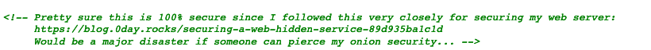
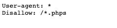
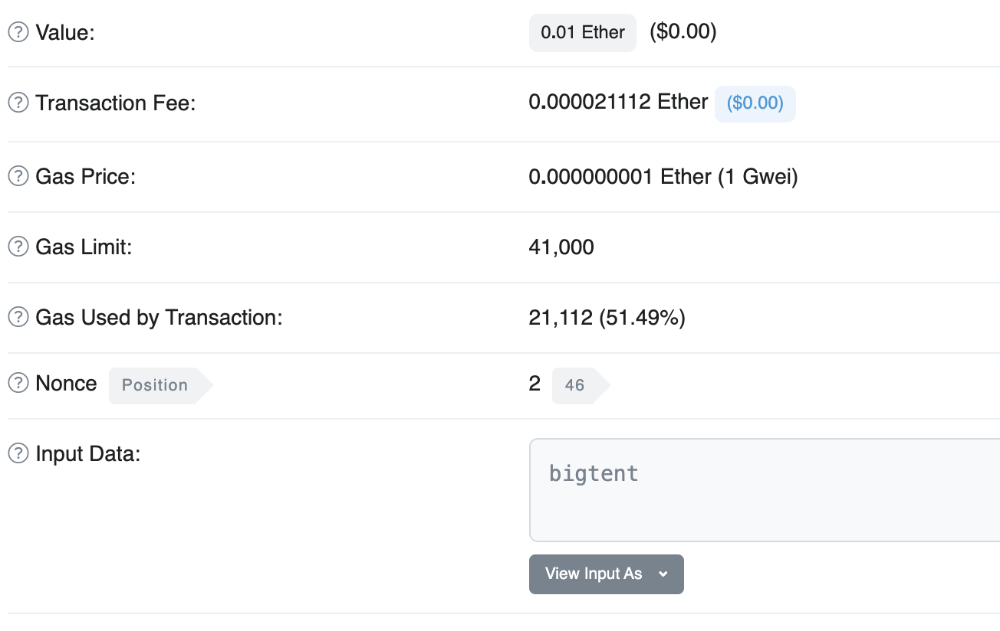

## 2021 Project 2

Ερωτήσεις:

1. Πού βρίσκεται ο Γιώργος;
1. Ποιος έκλεψε τα αρχεία του "Plan X";
1. Πού βρίσκονται τα αρχεία του "Plan X";
1. Ποια είναι τα results του "Plan Y";
1. Ποιο είναι το code του "Plan Z";

#### Παρατηρήσεις

- Οι ίδιες ομάδες με την εργασία 1
- Εγγραφή στο github: https://classroom.github.com/g/jlkOQHdH 
- Μόλις ολοκληρώσετε κάθε βήμα στέλνετε claim στο ys13@chatzi.org
- Για τα βήματα 3-5 απαιτείται να γράψετε ένα πρόγραμμα που να αυτοματοποιεί την εύρεση της λύσης.
  Μπορείτε να χρησιμοποιήσετε ό,τι γλώσσα προγραμματισμού θέλετε, αλλά θα πρέπει να μπορώ να το τρέξω
  σε Ubuntu 20.04 χρησιμοποιώντας software που είναι διαθέσιμο στο Ubuntu. Θα πρέπει επίσης
  να φτιάξετε ένα script `run.sh` που εκτελεί το πρόγραμμα με ό,τι παραμέτρους χρειάζονται.
- Επίσης γράφετε report στο README.md με τα βήματα που ακολουθήσατε, και το κάνετε commit μαζί με οποιοδήποτε κώδικα χρησιμοποιήσατε
- Βαθμολογία
    - Η δυσκολία στα βήματα αυξάνεται απότομα.
    - Για ό,τι δεν ολοκληρώσετε περιγράψτε (και υλοποιήστε στο πρόγραμμα) την πρόοδό σας και πώς θα μπορούσατε να συνεχίσετε.
    - Με τα πρώτα 2 βήματα παίρνετε 5 στο μάθημα (αν έχετε πάει καλά στην εργασία 1)
    - Με τα 3-5 φτάνετε μέχρι το 10 (δεν υπάρχει γραπτή εξέταση)
    - Για τους μεταπτυχιακούς τα 3-5 είναι προαιρετικά. ΔΕΝ αντικαθιστούν το project
     (αλλά μπορούν να λειτουργήσουν προσθετικά στο βαθμό της εργασίας 1)
    - Για τα βήματα 3-5 μπορεί να γίνει προφορική εξέταση
- Timeline
    - Την πρώτη εβδομάδα δεν υπάρχουν hints
    - 11/6: αρχίζουν τα hints για τα βήματα 1,2
    - 16/6: deadline για τα βήματα 1,2
    - Για τα βήματα 3-5 δίνονται hints μόνο σε όσους ζητήσουν (με μικρό penalty)
    - 11/7: deadline για τα βήματα 3-5
- Η ταχύτητα των λύσεων (και ο αριθμός hints που έχουν δοθεί) μετράει στο βαθμό
(ειδικά για τα βήματα 1,2)

- __Οχι spoilers__
- __Οχι DoS__ (ή μαζικά requests, δε χρειάζεται
κάτι τέτοιο)

## REPORT
#### Ερώτημα 1ο

- Βλέποντας την αρχική εικόνα και την κατάληξη .onion καταλάβαμε οτι πρόκειται για ένα site στο tor. Το οποίο ήταν (1) http://2bx6yarg76ryzjdpegl5l76skdlb4vvxwjxpipq4nhz3xnjjh3jo6qyd.onion/. Ανοίγοντας τον source code της σελίδας παρατηρήσαμε ένα σχόλιο που μας παρέπεμπε σε ένα blog το οποίο περιέγραφε τους τρόπους όπου ένα onion site μπορεί να προστατευτεί. Εκεί παρατηρήσαμε ότι ανέφερε ότι δεν θα πρέπει να παρέχετε πρόσβαση στις σελίδες /server-info και /server-status. Δοκιμάζοντας τα είδαμε οτι η http://2bx6yarg76ryzjdpegl5l76skdlb4vvxwjxpipq4nhz3xnjjh3jo6qyd.onion/server-info ήταν προσπελάσιμη.     
- Απο την σελίδα /server-info παρατηρήσαμε ότι υπάρχει και αλλό site που έτρεχε στον ίδιο web server. Αυτό το site ήταν το (2) http://flffeyo7q6zllfse2sgwh7i5b5apn73g6upedyihqvaarhq5wrkkn7ad.onion/
Μην γνωρίζοντας πως θα περάσουμε το authentication είδαμε το hint < Ο οργανισμός του YS13 έχει και robotics department >. Το διαδίκτυο μας έδωσε την λύση ότι τα site που τρέχουν σε Apache server 
περιέχουν ενα αρχείο /robots.txt. Στο site (2) μας έδωσε το αποτέλεσμα ότι κάνει disallow όλες τις .phps σελίδες.  
 Από το source code της σελίδας (2) είχαμε δεί ότι για το authentication γινόταν κλήση του αρχείου /access.php, το οποίο το τρέξαμε σαν /access.phps και μας έδωσε τον κώδικα της σελίδας. 
- Το αρχέιο /access.phps περιείχε ένα γρίφο για να βρούμε το username < i set $desired to the 48th multiple of 7 that contains a 7 in its decimal representation > με μια αναζήτηση "το είχαν ψάξει κι'άλλοι" ότι το αποτέλεσμα είναι το 1337. Έπρεπε όμως να περάσουμε και τον έλεγχο ότι το μήκος έπρεπε να είναι 7. Μετά απο αρκετές προσπάθειες η απάντηση ήταν εύκολη και ήταν το 0001337.
Αφού είχαμε περάσει τον έλεγχο του username έπρεπε να περάσουμε την strcmp για το password. Στο διαδίκτυο ανακαλύψαμε ότι αν μία μεταβλητή την περάσεις ως array αντί για string τότε η strcmp επιστρέφει 0. Έχοντας τις παραπάνω πληροφορίες τρέξαμε το link http://flffeyo7q6zllfse2sgwh7i5b5apn73g6upedyihqvaarhq5wrkkn7ad.onion/access.php?user=0001337&password[]=asd το οποίο μας έδωσε πρόσβαση στην σελίδα.    
- Στην συνέχεια κατευθυνθήκαμε στην σελίδα http://flffeyo7q6zllfse2sgwh7i5b5apn73g6upedyihqvaarhq5wrkkn7ad.onion/blogposts7589109238/blogposts/. Στο αρχείο /post3.html βρήκαμε την πληροφορία ότι έπρεπε να συνδεθούμε σαν vistor=#834472 για να έχουμε πρόσβαση στα backup αρχεία. Στο site (1) στείλαμε ενα http request θέτοντας ως visitor το 834472. To response που πήραμε μας έδινε την πληροφορία "bad base64". Τοτε πήραμε το default visitor 204, και αποκρυπογραφήσαμε με base64 το cookie του και πήραμε το παρακάτω αποτέλεσμα      Το πρώτο κομμάτι μας έδινε τον αριθμό του visitor, οπότε το αλλάξαμε στο ζητούμε visitor number και ξανακρυπτογραφήσαμε με base64. Το αποτέλεσμα που πήραμε ήταν "bad sha256". Μετά απο αρκετές προσπάθειες καταλάβαμε ότι το string μετά το visitor number ήταν το visitor number κρυπτογραφημένο σε "sha256", οπότε βρήκαμε το σωστό cookie και πήραμε το αποτέλεσμα    
- Στην συνέχεια κατευθυνθήκαμε στην σελίδα που μας παρέπεμπε και βρήκαμε τα ακόλουθα περιεχόμενα      Παρατηρήσαμε ότι υπάρχουν 2 κρυπτογραφημένα αρχεία όπου έπρεπε να βρούμε το passphrase για να έχουμε πρόσβαση. Το αρχείο /notes.txt μας έδινε την πληροφορία πως θα βρίσκαμε το passphrase αλλά είχαμε δύο αγνώστους, το "secret string" και η ημερομηνία κρυπτογράφησης των αρχείων.       Ψάχνοντας στο διαδίκτυο βρήκαμε ότι το "ropsten" είναι ένα testing network για το etherium. Βάζωντας το address που μας δώθηκε πήραμε το παρακάτω αποτέλεσμα.      Οπότε καταλάβαμε ότι το sccret string ήταν το "bigtent". Για να βρόυμε την ημερομηνία κρυπτογράφησης φτιάξαμε ένα script σε python όπου θα έκανε brute force ημερομηνίες. Τελικά βρήκαμε την σωστή ημερομηνία "2021-01-04". Το αρχέιο signal.log.gpg μας έδωσε το hash code ενός commit στο github   . Στην συνέχεια χρησιμοποιήσαμε το ίδιο passphrase για να αποκρυπτογραφήσουμε και το αρχείο firefox.log.gz.gpg. Ανοίγωντας το παρατηρήσαμε εκατομμύρια ίδιες εγγραφές γιαυτό σκεφτήκαμε να τρέξουμε την εντολή uniq "uniq -u firefox.log" για να βρούμε τις διαφορές,  οποία μας έδωσε το github repo https://github.com/asn-d6/tor. Έχοντας πλέον το repo ψάξαμε το συγκεκριμένο commit.     
- Βλέποντας τις παραμέτρους Ν,e καταλάβαμε ότι πρόκειται για RSA cryptography και κάνοντας τους υπολογισμούς με την βοήθεια των διαφανειών του μαθήματος βρήκαμε ότι το x=306, y=3735 τα αντικαταστήσαμε στο παραπάνω link και βρήκαμε την τοποθεσία του Γίωργου.     

#### Ερώτημα 2o

- Για το δεύτερο ερώτημα ανακατεθυνθήκαμε στην σελίδα http://flffeyo7q6zllfse2sgwh7i5b5apn73g6upedyihqvaarhq5wrkkn7ad.onion/blogposts7589109238/blogposts/diary2.html καθώς εκεί είχαμε παρατηρήσει την πληροφορία που μας χρειαζόταν για την επίλυση του. Αυτό μας παρέπεμπε στην σελίδα http://zwt6vcp6d5tao7tbe3je6a2q4pwdfqli62ekuhjo55c7pqlet3brutqd.onion/ και ότι το συγκεκριμένο site χρησιμοποιούσε τον pico server απο το repo github:chatziko/pico. Στην συνέχεια το κάναμε clone σε ένα δικό μας μηχάνημα και προσπαθήσαμε να το τρέξουμε. Το compilation μας έδωσε το wanrning      Ουσιαστικά μας ειδοποιούσε ότι δεν έχουμε θέσει τον τύπο μεταβλητής στην printf για την εκτύπωση. Τότε σκεφτήκαμε ότι μπορόυμε να εκτυπώσουμε τα περιεχόμενα του stack του προγράμματος. Μετά απο αρκετές προσπάθειες βρήκαμε ότι στο πεδίο username έπρεπε να μπει "%x%x%x%x%x%x%s" έτσι ώστε να εκτυπώσουμε τα περιεχόμενα της στοίβας και πήραμε το αποτέλεσμα      To password ήταν κρυπτογραφημένο σε md5 το αποκρυπτογραφήσαμε και βρήκαμε ότι είναι "bob's ypur uncle" και το username ήταν admin. Tα βάλαμε και πήραμε πρόσβαση στην σελίδα.   .

